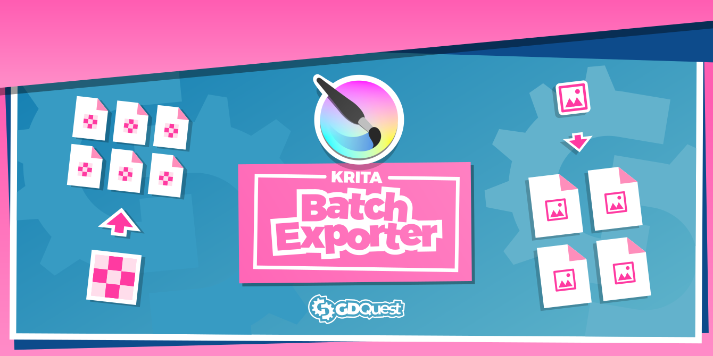

# Krita Batch Exporter



Export your game assets, sprites, designs, and more with speed and flexibility!

This Free Krita 4 add-on is a tool to help designers, game artists, and digital artists to work more productively.

_Batch Exporter is now an official add-on and comes pre-installed in Krita 4.4.0._

➡ Follow us on [Twitter](https://twitter.com/NathanGDQuest) and [YouTube](https://www.youtube.com/c/gdquest/) for free game creation tutorials, tips, and news! Get one of our [Godot game creation courses](https://gdquest.mavenseed.com/) to support our work on Free Software.

Batch Exporter brings smart batch layer export and renaming. With it, you can **automatically re-export** groups and layers to specific folders, **scale images on export**, and more! All that using Krita 4's new background save. If you've ever used Photoshop's Generator feature, this is similar.


Our goal is to extend and enhance powerful but underused features that already exist in Krita to empower artists.

## How to Use and video demo

You can find a [video intro and tutorial](https://youtu.be/jJE5iqE8Q7c) on our YouTube channel.

The plugin also comes with [text-based](https://github.com/GDquest/krita-batch-exporter/blob/master/batch_exporter/Manual.md) documentation.

## Activating the add-on

Batch exporter comes pre-installed in Krita 4.4.0+, so all you have to do is to activate it:

1. Go to the Settings menu -> Configure Krita -> Python Plugin Manager.
2. Click the checkbox next to Batch Exporter.

You are now ready to use it!

## How to install

Here's how to install the add-on from this repository.

### Using the auto-install script

You can run the install script `./install.sh` from your terminal. On Windows, you must run this program from a bash shell. If you have git installed, you can use git bash, otherwise the Windows Subsystem for Linux.

```sh
chmod +x install.sh # Make the program executable
./install.sh # Executes the program and installs the add-on
```

It should install all the files you need for the add-on to work in Krita 4.2 and above. It can also upgrade the add-on for you, replacing older versions you had already installed.

### Manual installation

To install the add-on manually, you need to:

1. Download the "Source code (zip)" file in the [latest release](https://github.com/GDQuest/krita-batch-exporter/releases)
1. Open Krita and go to the Settings menu -> Manage Resources
1. Click "Open Resources Folder" to access your Krita resources directory
1. Copy and paste the `krita_batch_exporter/` folder and the `kritapykrita_batch_exporter.desktop` file in the `pykrita/` directory.

## Follow us, Support our work

Krita Batch Exporter is a GDQuest project. Our mission is to bring people together to become better game developers, all that using and contributing to Free Software.

This add-on's development is funded by our [game creation courses for Godot](https://gdquest.mavenseed.com/). Consider getting one to support our work!

We make Free tutorials and tools to learn game creation. You can find us on:

- [Our YouTube channel](https://www.youtube.com/c/gdquest/)
- [Twitter](https://twitter.com/NathanGDquest)

We also have a [Discord community](https://discord.gg/CHYVgar)!
